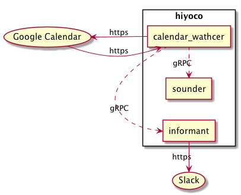

# hiyoco
hiyocoは，複数のサービスによって構成されたアプリケーションであり，以下の機能をもつ．
1.  Google カレンダーから予定を取得
2.  取得した予定を，slackの特定のチャンネルに投稿
3.  取得した予定の内容を，AIY Voice Kit を利用して発言

hiyocoは，以下のサービスによって構成されている．

1. calendar_watcher
   + Google カレンダーから予定の取得を行うサービスである．
   + また，他のサービスに取得した予定を送信する．

2. informant
   + calendar_watcherから取得した予定を，Slackに投稿するサービスである．

3. sounder
   + calendar_wathcerから取得した予定の内容を，AIY Voice Kit を利用して発言するサービスである．
   + 動作環境として，AIY Voice Kit 上で動かすことを前提とする．

各サービス間での連携はgRPCによって実現されている．
hiyocoと各サービスの関係の概念図を以下に示す．



# Requirements
+ Ruby 2.4.3(for calendar_watcher)
+ Python 3.x(for informant and sounder)
+ AIY Voice Kit(for sounder)

# Setup for production

TBA...

# Setup for development
1. ソースコードの取得
```
  $ git clone https://github.com/nomlab/hiyoco
```

2. 各サービスのセットアップ

必要なサービスのセットアップを行う．
各サービスのセットアップ方法は，hiyoco/servicesの各サービスのディレクトリのREADMEに記されている．
具体的なリンクを以下に示す．

+ calendar\_watcher: https://github.com/nomlab/hiyoco/tree/master/services/calendar_watcher
+ informant: https://github.com/nomlab/hiyoco/tree/master/services/informant
+ sounder: https://github.com/nomlab/hiyoco/tree/master/services/sounder

# Usage
TBA...

# Directory Structure
```
    hiyoco
    ├── docs/
    ├── proto/
    └── services/
```

+ docs
  + .protoファイルから生成したドキュメントを格納する．
+ proto
  + 各サービスが利用する.protoファイルを格納する．
+ services
  + hiyocoを構成するサービスを格納する．
